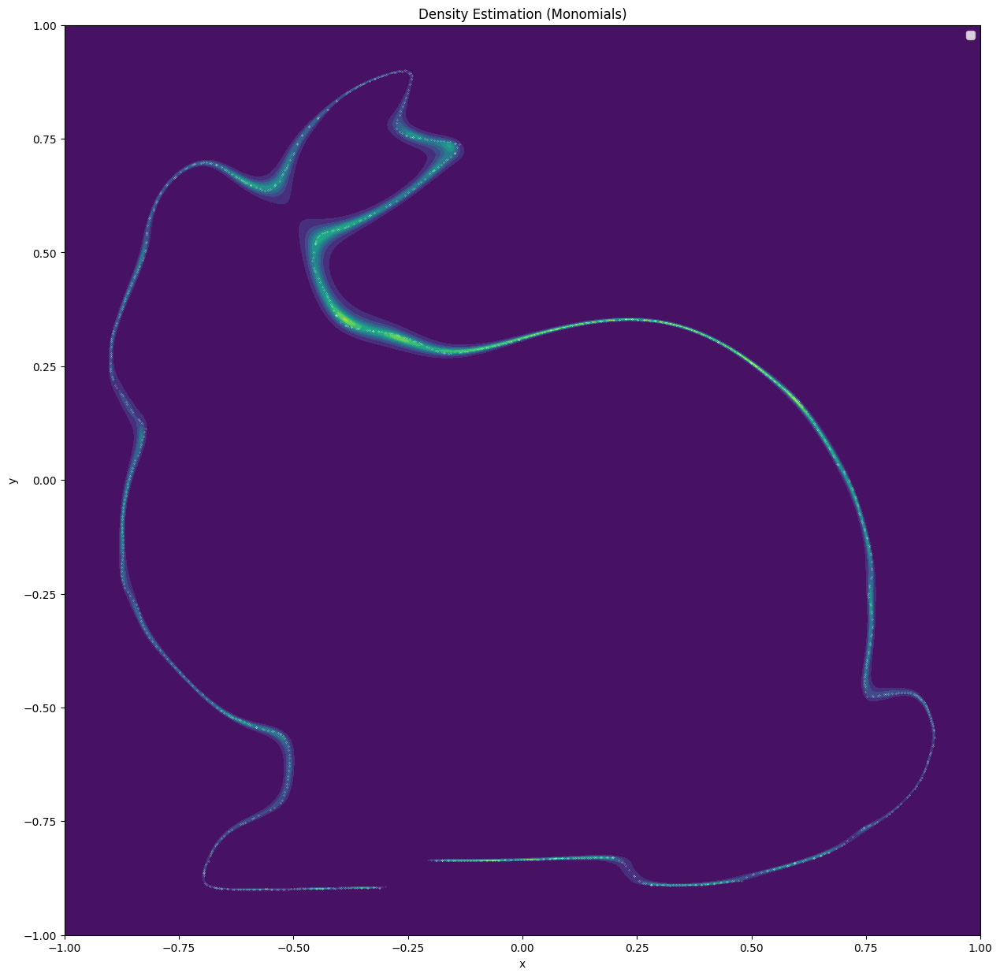
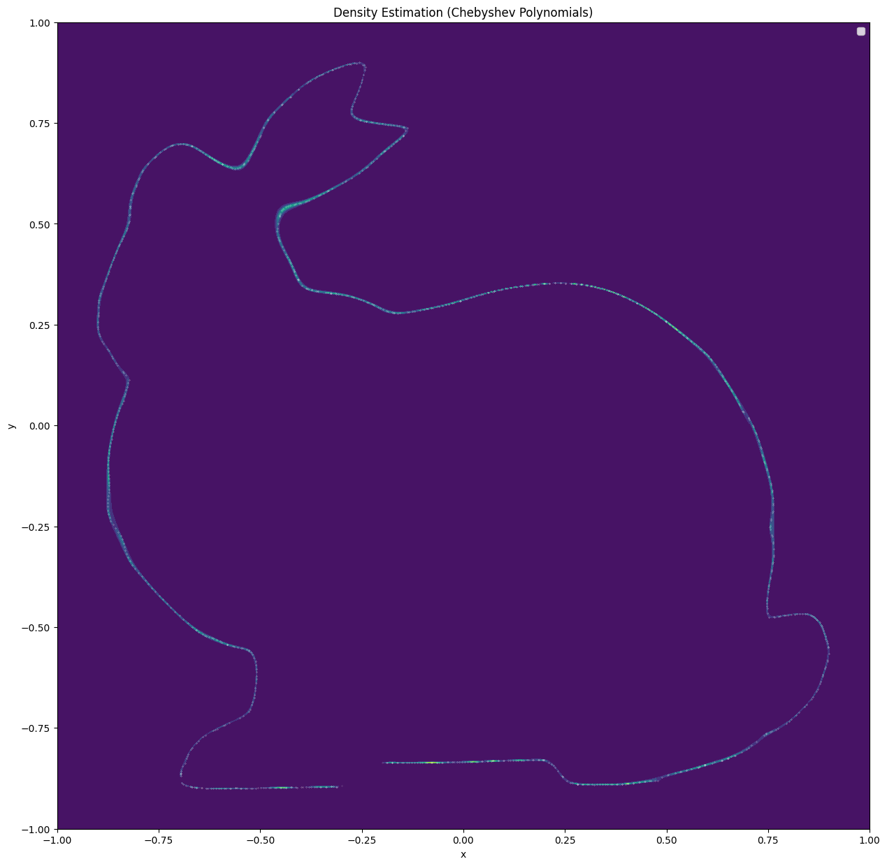
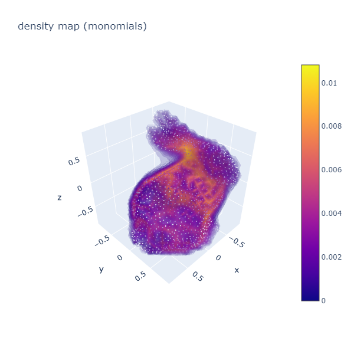
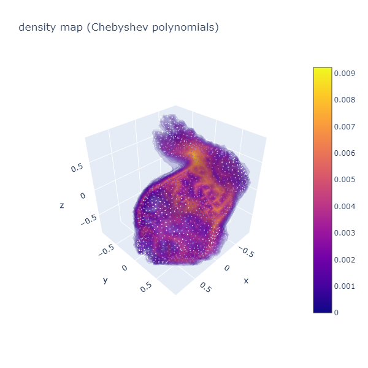

# Point Cloud Moment

### Installation
Required Packages:
```
tqdm
numpy
scipy
sklearn
matplotlib
itertools
open3d
plotly
pytorch
```

### Recover the discrete point cloud measures with Christoffel-Darboux Kernel

#### 2D Stanford Bunny
see [cd_aprox_cheby_2d.ipynb](cd_aprox_cheby_2d.ipynb)




#### 3D Stanford Bunny
see [cd_aprox_cheby_3d.ipynb](cd_aprox_cheby_3d.ipynb)




#### Classification on ModelNet40
see [moment_classifier.ipynb](moment_classifier.ipynb)